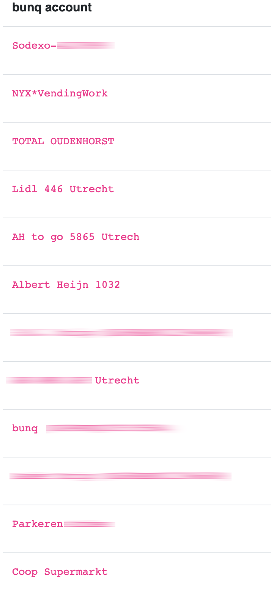
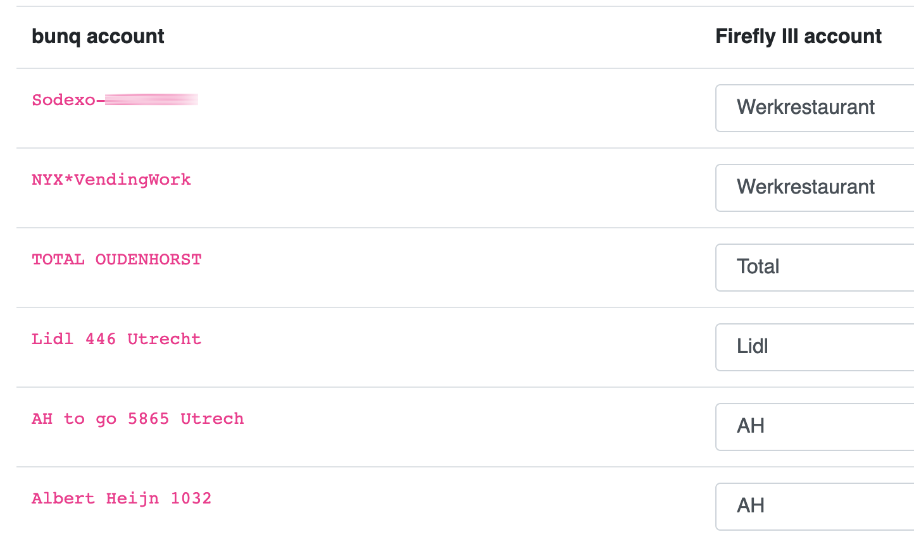

# Map data

If you import data into Firefly III, you may notice that Spectre / Salt Edge isn't particularly "clean" when it comes to account names. Check out this example:

In this example you'll see various weird things. You can expect stuff like this:

- One restaurant with two different names.
- Several shops with their location in the name.
- Date information in the name.

To fix this, Firefly III supports a process called "mapping" where you can link values like these to one unified shop entry. This example will make it pretty clear. It is taken directly from the Spectre / Salt Edge importer:

You can map account names to values already present in your Firefly III database. This will greatly smooth out the import process.
